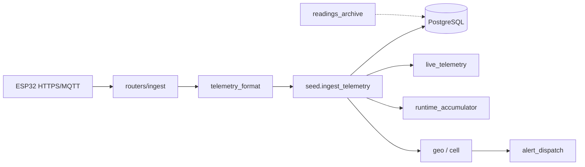

# Разбор Python-бэкенда HydroWin

Обзор всех продуктовых `.py` в `backend/app/` (логика и алгоритмы, без правок кода).  
Вспомогательные скрипты в корне репо (`_extract_ble_*.py` и т.п.) — разовые утилиты агента, не API.

Связка с прошивкой: ESP32 шлёт industrial JSON → здесь разворачивается и пишется в PostgreSQL.  
См. также [`../firmware/FIRMWARE_WALKTHROUGH.md`](../firmware/FIRMWARE_WALKTHROUGH.md).



---

## 1. Карта модулей

### Entrypoint и инфраструктура

| Файл | Роль |
|------|------|
| [`main.py`](app/main.py) | FastAPI: lifespan (schema/indexes/seed/MQTT/purge), CORS, health, admin, история датчика |
| [`config.py`](app/config.py) | Settings из env; `assert_secure_secrets` |
| [`database.py`](app/database.py) | Engine, `SessionLocal`, `Base`, `get_db` |
| [`models.py`](app/models.py) | ORM: org/user/device/machine/sensor/reading/events/GPS/geofence/dedup/… |
| [`schema_migrate.py`](app/schema_migrate.py) | `ALTER IF NOT EXISTS` для multi-org |
| [`db_indexes.py`](app/db_indexes.py) | Индексы производительности |
| [`security_middleware.py`](app/security_middleware.py) | Security headers |
| [`ops_metrics.py`](app/ops_metrics.py) | In-memory метрики ingest / система |

### Auth, ACL, роли

| Файл | Роль |
|------|------|
| [`security.py`](app/security.py) | bcrypt паролей, HMAC device key, JWT, `evaluate_status` / offline 120 с |
| [`password_policy.py`](app/password_policy.py) | Сложность пароля |
| [`deps.py`](app/deps.py) | `get_current_user`, `get_device_by_key`, JSON-сериализация |
| [`roles.py`](app/roles.py) | Константы ролей (admin/driver/dispatcher/…) |
| [`org_types.py`](app/org_types.py) | platform / manufacturer / client |
| [`org_access.py`](app/org_access.py) | Видимость и запись машин по org+роли |
| [`rate_limit.py`](app/rate_limit.py) | Sliding-window limiter (ingest и др.) |

### Телеметрия (ядро)

| Файл | Роль |
|------|------|
| [`routers/ingest.py`](app/routers/ingest.py) | `POST /v1/ingest/telemetry` |
| [`telemetry_format.py`](app/telemetry_format.py) | Industrial ↔ verbose, faultMask |
| [`seed.py`](app/seed.py) | Demo seed + **`ingest_telemetry`** |
| [`sensor_service.py`](app/sensor_service.py) | Создание/дедуп датчиков, lab BLOCK |
| [`sensor_catalog.py`](app/sensor_catalog.py) | Типы CH0–CH5, шкалы по умолчанию |
| [`live_telemetry.py`](app/live_telemetry.py) | `last_*` на Sensor, fleet live JSON |
| [`runtime_accumulator.py`](app/runtime_accumulator.py) | Uptime / моточасы / насос |
| [`mqtt_worker.py`](app/mqtt_worker.py) | MQTT → тот же pipeline |

### Гео и алерты

| Файл | Роль |
|------|------|
| [`geo.py`](app/geo.py) | Haversine, трек, geofence enter/exit |
| [`cell_locate.py`](app/cell_locate.py) | Unwired Labs / OpenCellID |
| [`cell_cache.py`](app/cell_cache.py) | PG-кэш вышек |
| [`alert_dispatch.py`](app/alert_dispatch.py) | Critical → push/email/telegram |
| [`telegram_resolve.py`](app/telegram_resolve.py) | @username → chat_id |
| [`services/notification_delivery.py`](app/services/notification_delivery.py) | Отправка каналов |
| [`email_templates.py`](app/email_templates.py) | HTML/plain алертов |

### Хранение и очистка

| Файл | Роль |
|------|------|
| [`readings_archive.py`](app/readings_archive.py) | Raw → hourly → daily, purge, история |
| [`readings_retention.py`](app/readings_retention.py) | Тонкая обёртка maintenance |
| [`time_bucket.py`](app/time_bucket.py) | SQL time-bucket без Timescale |
| [`purge.py`](app/purge.py) | Каскадное удаление machine/user/org |
| [`scripts/purge_old_readings.py`](../scripts/purge_old_readings.py) | CLI-запуск очистки |

### API-роутеры

| Роутер | Эндпоинты (кратко) |
|--------|---------------------|
| `auth` | register / login / refresh / change-password / logout |
| `machines` | CRUD машин/датчиков/устройств, fleet live, readings, transfer |
| `organizations` | orgs, users, assign-machine |
| `events` | список + acknowledge |
| `geofences` | geofence + track |
| `notifications` | settings, test telegram/email |
| `audit` | журнал аудита |
| `media` | аватары / фото машин |
| `ingest` | телеметрия платы |

### Прочее

| Файл | Роль |
|------|------|
| [`audit.py`](app/audit.py) | `write_audit` |
| [`avatar_storage.py`](app/avatar_storage.py) / [`machine_photo_storage.py`](app/machine_photo_storage.py) | Файлы на диск |
| `tests_runtime_accumulator.py`, `tests_cell_telemetry.py` | Юнит-тесты алгоритмов |
| `mobile/.../regenerate-windows-icon.py` | Иконка Windows (не backend) |

---

## 2. Главный pipeline телеметрии

### 2.1 Вход

1. **HTTPS** [`routers/ingest.py`](app/routers/ingest.py): `X-Device-Key` → rate-limit → `normalize_telemetry_payloads` → цикл `ingest_telemetry`.
2. **MQTT** [`mqtt_worker.py`](app/mqtt_worker.py): топик `hydrowin/telemetry/{device_id}`, в JSON обязателен `device_key`; дальше тот же normalize + ingest.

Ответ HTTPS: **202** без тела (успех).

### 2.2 Industrial → verbose

[`telemetry_format.py`](app/telemetry_format.py) — зеркало прошивки:

```
{"d":[[unix_ts, ch0..ch5, faultMask], ...]}  →  list[TelemetryIngest-like dict]
```

Раскладка строки:

| Длина | Смысл |
|-------|--------|
| ≥8 | 6 каналов + faultMask |
| 7 | 6 каналов без fault |
| 6 | legacy 4 канала + fault |
| 5 | legacy 4 канала |

- `faultMask`: 2 бита/канал → `1=open`, `2=short` (как на ESP32).
- `ts_unix == 0` → время сервера (плата без NTP).
- `message_id` дедупа: `d-{sha8(device)}-{ts}[-i]` (или явный из JSON).
- Макс. 60 строк в одном POST.

### 2.3 `ingest_telemetry` (сердце)

[`seed.py`](app/seed.py):

```
1. Dedup по message_id (IngestDedup) → выход, если уже было
2. machine_id / device_id должны совпасть с Device
3. По каждому сенсору канала:
   - fault из маски / current_ma / legacy value∈(0,3.2)
   - open/short → Event critical (cooldown 5 мин на тип+сенсор)
   - иначе evaluate_status → threshold warning/critical
   - Reading + apply_sensor_live
4. accumulate_runtime (uptime / engine / pump)
5. machine.status = worst; last_seen; headline_alert
6. GPS: если accuracy < 200 м → GNSS + опционально remember_cell
   иначе cell → PG-кэш или locate_cell → apply_machine_gps
7. IngestDedup + dispatch_new_critical_events + commit
```

Нюанс fault: при open/short давление/температура **обнуляются** для runtime (`pressure_ok=False`), чтобы ток мА в value не считался «барами».

---

## 3. Алгоритмы

### 3.1 Статус датчика и машины

[`security.py`](app/security.py):

- Пороги сенсора → `ok` / `warning` / `critical`.
- Машина **offline**, если `last_seen_at` старше **120 с**.
- `worst_status` по каналам пакета; headline из critical/warning сообщений.

### 3.2 Runtime / насос

[`runtime_accumulator.py`](app/runtime_accumulator.py):

- Между пакетами учитывается только зазор **0 < gap ≤ 180 с** (иначе дыра в связи).
- **uptime_hours** += δ при любом валидном зазоре.
- **engine_hours** (моточасы), если `hydraulics_working`:
  - P ≥ порог (~50 бар или 40% `norm_min`, min 30), **или**
  - P ≥ ½ порога **и** T ≥ порог температуры.
- **pump_is_on**:
  - P > порог машины / 5% шкалы / default 20 бар, **или**
  - T > порог **и** `pressure_ok` (нет open/short на давлении).
- **pump_starts**: фронт `was_off → on`.

### 3.3 GPS и геозоны

[`geo.py`](app/geo.py):

- Отсев Null Island (`|lat|,|lon| < 0.05`) и скачков **> 500 км**.
- Трек: не чаще **20 с** / **15 м**.
- Geofence: круг; снаружи — буфер `max(accuracy, 50 м)`.
- Exit → Event critical (cooldown 5 мин) + headline; enter → info.
- GNSS с `acc ≥ 200` не пишется как GPS — fallback на соту.

### 3.4 Cell locate

[`cell_locate.py`](app/cell_locate.py) + [`cell_cache.py`](app/cell_cache.py):

1. Lookup в PG (`CellTowerCache`).
2. Иначе Unwired (`pk.*`) или OpenCellID.
3. In-memory TTL 24 ч; accuracy clamp 100…50000 м.
4. При хорошем GNSS — `remember_cell_tower` для следующих LBS.

### 3.5 Архив readings

[`readings_archive.py`](app/readings_archive.py):

| Слой | Срок (default) |
|------|----------------|
| Raw `readings` | ~30 дн. |
| `readings_hourly` / `daily` | ~180 дн. |

Цикл `maintain_readings_storage`: rollup raw→hourly→daily → purge.  
История API: сырые / hourly / daily / смесь на стыке горизонта; окно clamp к `archive_days`.  
Статус бакета = худший в интервале.

### 3.6 Rate limit

[`rate_limit.py`](app/rate_limit.py): скользящее окно в памяти, ключ `scope:ip[:device_id]`. IP из `X-Real-IP` / последний hop `X-Forwarded-For`.

### 3.7 ACL машин

[`org_access.py`](app/org_access.py):

| Кто | Видит | Пишет |
|-----|-------|-------|
| Platform | всё | да |
| Manufacturer | свои (склад + проданные) | склад; проданные чаще readonly |
| Client | свои | по роли |
| Driver | только `assigned_machine_id` | нет |

### 3.8 Device key

[`security.py`](app/security.py): HMAC-SHA256 с pepper; legacy SHA256 для миграции (`device_key_hash_candidates`).

### 3.9 Алерты

[`alert_dispatch.py`](app/alert_dispatch.py): только `severity=critical`; quiet hours; каналы push (лог) / email / telegram; warning остаётся в журнале Events.

---

## 4. Lifespan при старте

[`main.py`](app/main.py) `lifespan`:

1. `assert_secure_secrets`
2. `create_all` + `apply_org_schema` + indexes
3. Platform org; в non-prod — demo multi-org + lab BLOCK machine
4. MQTT worker (если настроен)
5. Фоновый цикл `maintain_readings_storage` каждые N часов

---

## 5. Связь с ESP32

| Прошивка | Backend |
|----------|---------|
| `{"d":[[ts,ch…,faultMask]]}` | `expand_industrial` |
| fault 1/2 open/short | те же биты → Events |
| value при fault = мА | не идёт в моточасы (pressure_ok) |
| GPS раз в мин | geofence + track throttle |
| Offline queue на плате | серверный `IngestDedup` по message_id |
| `X-Device-Key` | `get_device_by_key` |

---

## 6. Не-продуктовые скрипты

В корне `/workspace`: `_extract_ble_transcript.py`, `_deep_dump_ble.py`, `_find_ble_in_transcripts.py`, `_list_all_writes.py`, `_extract_named_writes.py` — разбор транскриптов агента (BLE restore), к API HydroWin не относятся.
