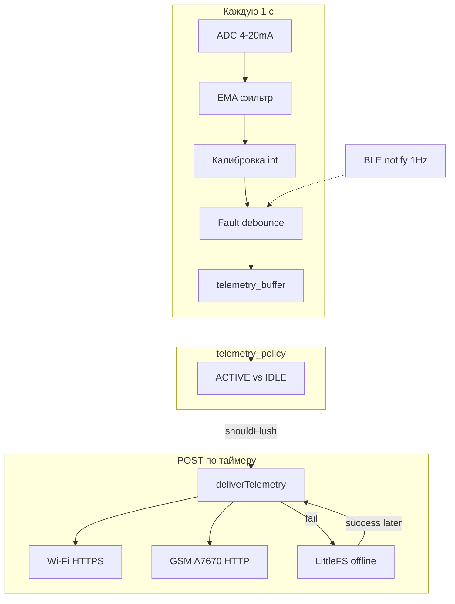

# Разбор ESP32-прошивки HydroWin

Обзорный разбор логики и алгоритмов (без изменения кода). Общая библиотека — `esp32_ingest/*.h`; скетчи только задают пины / `LINK_MODE` / `SENSOR_TABLE`.

Backend (ingest, runtime, geo): [`../backend/PYTHON_WALKTHROUGH.md`](../backend/PYTHON_WALKTHROUGH.md).

## Три сборки

| Сборка | Entry | Возможности |
|--------|-------|-------------|
| **lite** | `lite_esp32/lite_esp32_ingest/` | датчики + BLE, без облака |
| **esp32_ingest** | `esp32_ingest/esp32_ingest.ino` | Wi‑Fi HTTPS + BLE (classic ESP32) |
| **full_ta7670** | `full_ta7670_*/*.ino` | LTE + GPS + Wi‑Fi + BLE |



---

## 1. Главный loop и датчики

### 1.1 Цикл облачных сборок

`esp32_ingest.ino` / `full_ta7670_*.ino` — один и тот же каркас:

1. `handleBlockSetupSerial()` — USB-команды (`CAL` / `WIFI` / `KEY` / …)
2. `updateSensors()` — АЦП → мА → value / fault
3. `bleLoop()` — notify телеметрии 1 Гц
4. `telemetryPolicyTick()` — ACTIVE / IDLE
5. раз в `TELEMETRY_SAMPLE_MS` (1 с) → `sampleTelemetry()` → буфер
6. если `telemetryShouldFlush` → `postTelemetry()`

Lite — только шаги 1–3 (без буфера и сети). На `esp32_ingest` режим связи принудительно `LINK_WIFI` (GSM на classic ESP32 нет).

### 1.2 АЦП → ток (мА)

Файл: [`esp32_ingest/sensors.h`](esp32_ingest/sensors.h).

1. **16 замеров** `analogReadMilliVolts(pin)` → среднее (`ADC_SAMPLES`).
2. **EMA** на мВ: `filtered += α * (raw - filtered)`, `α = EMA_ALPHA` (0.45).
3. **Ток**: `mA = (mV / ADC_SHUNT_OHM) * ADC_MA_GAIN`, шунт 150 Ω, clamp 0…25 мА.

Зачем EMA после усреднения: убирает медленный джиттер АЦП, чтобы целое value (бар/°C) не прыгало на ±1 от шума на каждом тике.

### 1.3 Линейная калибровка 4–20 мА

Файл: [`esp32_ingest/calibration.h`](esp32_ingest/calibration.h).

```
ratio = (clamp(mA, 4, 20) - 4) / 16
value = scaleMin + ratio * (scaleMax - scaleMin) + offset
```

- В телеметрию и BLE уходит **целое** (`lroundf`).
- Если `scaleMin >= 0` и value < 0 → clamp к 0 (давление не уходит в минус от ZERO/шума).
- Параметры в NVS: `s{N}_min`, `s{N}_max`, `s{N}_off`, `s{N}_en` (namespace `hydrowin`).

`CAL <ch> <min> <max> [off]` пишет шкалу напрямую.

### 1.4 ZERO и MATCH

Файл: [`esp32_ingest/block_setup.h`](esp32_ingest/block_setup.h). Оба работают только при `LOOP_OK` и `valid`.

**ZERO** (манометр в воздухе → 0 бар):

```
rawEng = scaleMin + ratio * (scaleMax - scaleMin)   // без offset
newOff = -rawEng                                    // → value = 0
```

**MATCH** (подогнать к эталону, напр. термометр):

```
rawEng = scaleMin + ratio * (scaleMax - scaleMin)
newOff = target - rawEng                            // → value = target
```

Offset сохраняется в NVS; после `reloadSensorCalibration` следующий `updateSensors()` уже даёт нужное целое.

### 1.5 Debounce обрыва / КЗ

Пороги (с гистерезисом вокруг 4…20):

| Мгновенно | Fault |
|-----------|--------|
| `< 3.2 мА` (`LOOP_OPEN_MA`) | OPEN |
| `> 21.0 мА` (`LOOP_SHORT_MA`) | SHORT |
| иначе | OK |

Смена `reading.fault` только после **3** подряд одинаковых тиков (`LOOP_FAULT_DEBOUNCE`):

- `instant == pending` → `streak++`
- иначе → `pending = instant`, `streak = 1`
- при `streak >= 3` → `applied = pending`

При OPEN/SHORT: `valid = false`, в `value` кладётся **ток мА** (округлённый) — так JSON/BLE несут диагностику без отдельного поля тока.

Порог OPEN 3.2 (не 4.0): у низа шкалы АЦП часто занижает ~4 мА до 3.1–3.5; иначе ложный OPEN.

---

## 2. Буфер, политика трафика, сеть, offline

### 2.1 Кольцевой буфер

Файл: [`esp32_ingest/telemetry_buffer.h`](esp32_ingest/telemetry_buffer.h).

- До `TELEMETRY_BUF_MAX` (64) строк.
- Строка: `[ts, ch0..ch5, faultMask]`.
- `faultMask`: 2 бита на канал — 0=ok, 1=open, 2=short.
- **ACTIVE**: каждую секунду новая строка.
- **IDLE**: перезаписывается **одна** последняя строка (не раздувать батч и не форсить flush каждые 60 с из‑за полного буфера).
- Переполнение: сдвиг головы, теряется самая старая секунда.
- JSON: `{"d":[[...],...]}`; на full — опционально `,"gps":{"lat":…,"lon":…}` не чаще `HYDROWIN_GPS_TELEM_INTERVAL_MS` (1 мин).

### 2.2 ACTIVE / IDLE

Файл: [`esp32_ingest/telemetry_policy.h`](esp32_ingest/telemetry_policy.h). Цель LTE ≤ ~100 МБ/мес.

| Режим | Условие | Интервал POST (типично) |
|-------|---------|-------------------------|
| ACTIVE | `\|Δvalue\| > 2` или смена fault | GSM 60 с / Wi‑Fi active 5 с |
| IDLE | стабильно ≥ 180 с | 60 с |

Правила:

1. Baseline — снимок value+fault по включённым каналам.
2. Стабильный OPEN/SHORT **не** мешает IDLE (канал «застыл»).
3. Смена fault или скачок value → ACTIVE; baseline подтягивается к текущему.
4. После успешного POST baseline обновляется, но **`s_telemIdle` / таймер стабильности не сбрасываются** — иначе каждый POST в покое заново ждал бы 3 минуты.

`telemetryShouldFlush`:

- буфер пуст → нет;
- буфер полный → да;
- есть активность (`telemetryForceFlush`) → flush по active-интервалу;
- иначе → flush по idle/active интервалу (`telemetryFlushIntervalMs`).

### 2.3 Доставка и AUTO

Файл: [`esp32_ingest/hydrowin_ingest.h`](esp32_ingest/hydrowin_ingest.h).

`postTelemetry()`:

1. Нет MACHINE (UUID 36) / KEY → сразу `enqueueOfflineTelemetry`, буфер clear.
2. Иначе JSON → `deliverTelemetry` по `linkMode`.
3. Успех → `telemetryPolicyOnFlush` + `flushOfflineQueue`.
4. Fail → enqueue + статус очереди.

**LINK_WIFI** — HTTPS на ESP (`WiFiClientSecure`, CA ISRG X1 или `TLS_INSECURE`).  
**LINK_GSM** — `A7670Modem::httpPost`.  
**LINK_AUTO** — `postTelemetryAuto`:

```
если active == WIFI:
  try GSM → иначе try Wi‑Fi
если active == GSM (или старт):
  try GSM → иначе try Wi‑Fi
```

Приоритет всегда GSM. Cooldown: GSM fail → 5 мин, Wi‑Fi fail → 30 с. Если физически Wi‑Fi уже connected — Wi‑Fi cooldown сбрасывается (быстрее вернуться с GSM).

### 2.4 GSM HTTP keep-alive

Файл: [`esp32_ingest/gsm_a7670.h`](esp32_ingest/gsm_a7670.h).

**Init (`begin`)**:

1. PWRKEY + скан pin-map LilyGO при тишине AT  
2. `ATE0`, `CMEE=2`  
3. SIM READY → регистрация сети → PDP/APN  
4. TLS: `sslversion=3` (TLS1.2), SNI, cipher `0xC02F`  
5. `enableGnss()` (если не `A7670_FORCE_EXTERNAL_GPS`)

**POST**:

- `A7670_HTTP_KEEPALIVE=1`: `httpSessionEnsure` держит HTTP-контекст; повторные `HTTPDATA` + `HTTPACTION=1` без полного TLS каждый раз.
- `=0` (часто SIM7670): каждый POST = `HTTPTERM` → `HTTPINIT` → PARA → DATA → ACTION → TERM.
- Закрытие сессии: idle без успешного POST (`A7670_HTTP_SESSION_IDLE_MS`, 1 ч), max age (`A7670_HTTP_SESSION_MAX_MS`, 1 ч), HTTP≠2xx, смена URL/headers.

### 2.5 Offline-очередь

Файл: [`esp32_ingest/offline_queue.h`](esp32_ingest/offline_queue.h).

- LittleFS `/q/NNNNNNNN.json`, id в NVS `hw_queue/next_id` (инкремент **до** записи — защита от дубля id при reboot mid-write).
- Макс. 120 файлов; при переполнении — drop oldest (FIFO по имени).
- Flush батчами по 8: `rewriteQueuedTelemetryIds` (если в старом JSON ещё есть `machine_id`/`device_id`) → `deliverTelemetry` → удалить файл.
- Мусор `< 48` байт или без `"d"` — drop без отправки.

---

## 3. BLE и платы full_ta7670

### 3.1 BLE Nordic UART

Файл: [`esp32_ingest/ble_config.h`](esp32_ingest/ble_config.h), детальнее [`BLE.md`](esp32_ingest/BLE.md).

- Advertise: `HydroWinN`
- Service / RX / TX — Nordic UART UUID (`config.h` ↔ Flutter `ble_uuids.dart`)
- RX: ASCII-команды как USB; конфиг (KEY/WIFI/…) только после `AUTH <PIN>`
- TX: текст ack + бинарная телеметрия 1 Гц

### 3.2 Пакет v2 (21 байт, CH0–CH5)

| Off | Size | Field |
|-----|------|-------|
| 0 | 1 | proto = `0x02` |
| 1 | 1 | flags (bit0 = GPS valid; на блоке обычно 0) |
| 2 | 4 | timestamp uint32 LE (сейчас uptime sec) |
| 6 | 12 | ch0..ch5 int16 LE ×10 |
| 18 | 2 | status: 2 бита × 6 каналов |
| 20 | 1 | CRC-8/MAXIM по байтам 0..19 |

Status: `0=ok`, `1=warning`, `2=short`, `3=open`. При fault в value канала идёт ток мА ×10.

Flutter: `telemetry_packet.dart` (`_parseV2`) + `crc8_maxim.dart`. Legacy v1 (14 байт, CH0–CH2) ещё принимается приложением.

### 3.3 Две full-платы

| | **SIM7670G internal GPS** (H707, чёрная) | **A7670G + L76K** (STAN, зелёная) |
|--|------------------------------------------|-----------------------------------|
| Модем | SIM7670G (GNSS внутри) | A7670G (без GNSS) |
| GPS | `AT+CGNSSPWR` / `CGNSSINFO` | UART2 L76K NMEA (`GPS_RX=45`) |
| `A7670_FORCE_EXTERNAL_GPS` | `0` | `1` |
| Modem UART | RX10 TX11 PWRKEY18 | RX5 TX4 PWRKEY46 |
| Keep-alive HTTP | часто `0` (ошибки 714/715) | обычно `1` |
| `LINK_MODE` default | `LINK_WIFI` (стенд) | `LINK_AUTO` |
| SENSOR_TABLE | GPIO 1,2,6,… | GPIO 1,9,14,15,16 |

Общий код: те же `sensors` / `telemetry_*` / `hydrowin_ingest` / `ble_config`. Скетч только переопределяет пины, GPS-флаги и в `loop` опрашивает GNSS/L76K → `g_gpsLat/Lon`.

---

## Конфиг

- Compile-time: [`config.h`](esp32_ingest/config.h) — интервалы, пороги, API host, пины по умолчанию.
- Runtime NVS `hw_net`: [`runtime_config.h`](esp32_ingest/runtime_config.h) — WIFI / GSM / API / LINK / MACHINE / DEVICE / KEY.
- Секреты только Serial/BLE/NVS, не в git.

## Быстрые ссылки по файлам

| Файл | Роль |
|------|------|
| `sensors.h` | АЦП, EMA, fault debounce |
| `calibration.h` | 4–20 → ед.изм., NVS |
| `telemetry_buffer.h` | кольцо + JSON |
| `telemetry_policy.h` | ACTIVE/IDLE |
| `hydrowin_ingest.h` | Wi‑Fi/GSM/AUTO POST |
| `gsm_a7670.h` | AT, HTTPS, GNSS |
| `offline_queue.h` | LittleFS очередь |
| `ble_config.h` | NimBLE + пакет v2 |
| `block_setup.h` | USB/BLE команды, ZERO/MATCH |
| `runtime_config.h` | NVS сеть/ключи |
