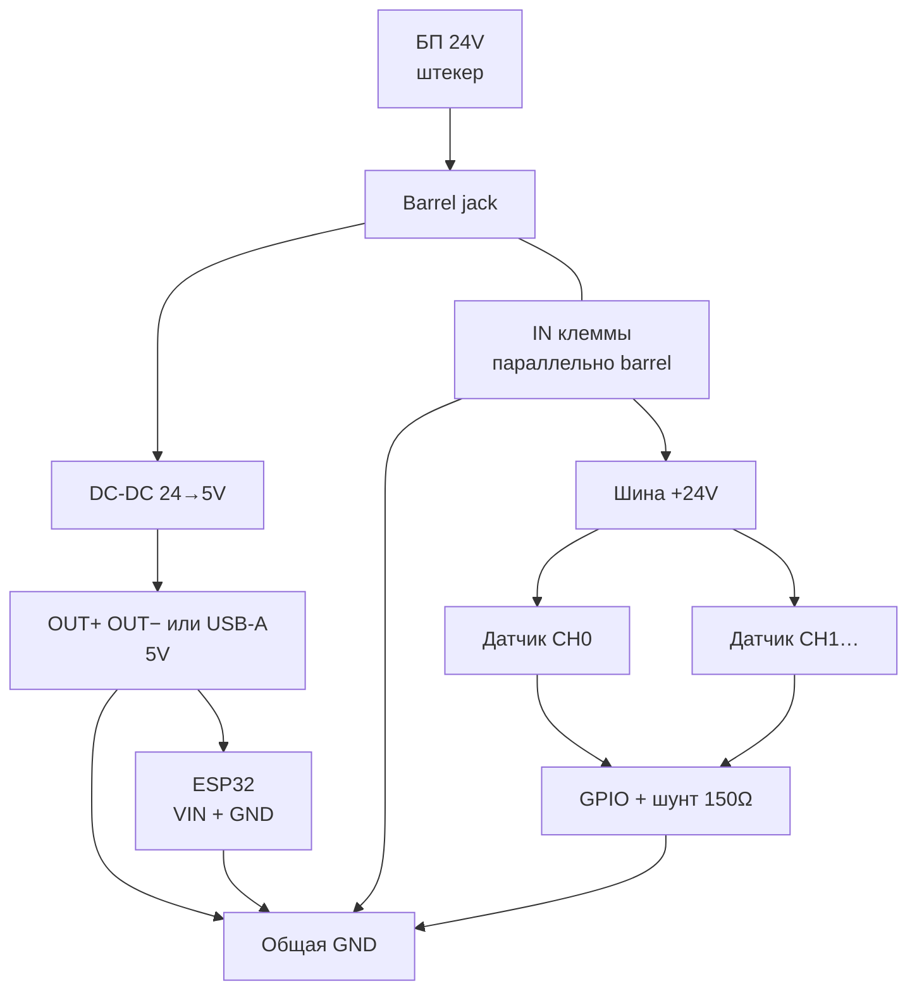

# HydroWin — схема питания 24 В → DC‑DC → ESP32 + датчики 4–20 мА

Монтажная инструкция для полевого блока с БП **24 В**, понижающим преобразователем **24→5 В (до 5 А)** и платами:

- **LILYGO T‑A7670G‑S3 + L76K** (зелёная PCB) — [BUILD.md](full_ta7670/full_ta7670_a7670g_external_l76k/BUILD.md)
- **LILYGO T‑SIM7670G‑S3 H707** (чёрная PCB) — [BUILD.md](full_ta7670/full_ta7670_sim7670g_internal_gps/BUILD.md)
- **ESP32 classic + внешний A7670** — [esp32_ingest.ino](esp32_ingest/esp32_ingest.ino)

---

## Два домена питания

| Потребитель | Напряжение | Откуда |
|---|---|---|
| ESP32 + LTE‑модем + L76K (если есть на плате) | **5 В, ≥ 2 А** | **OUT** DC‑DC (клеммы или USB‑A) → **VIN** платы |
| Датчики 4–20 мА (2‑проводные) | **24 В** (петля тока) | **Входные клеммы** рядом с barrel (= те же 24 V) |

Прошивка **не питает датчики с 5 В** — она измеряет ток через шунт **150 Ω** на GPIO ([config.h](esp32_ingest/config.h)).

> **VIN 5 В ≥ 2 А** обязательно для LTE. USB ПК / ноутбука часто не тянет модем.  
> USB на плате LilyGO — только прошивка и отладка; в поле питайте через **VIN**.

---

## Ваш модуль DC‑DC: barrel и входные клеммы параллельны

На модуле у входа два разъёма на одной шине:

| Разъём | Назначение |
|---|---|
| **(●) barrel jack** | Сюда вставляете штекер БП **24 V** |
| **Синие клеммы рядом** (IN+/IN−) | Те же **24 V** — сюда берёте питание датчиков |

```
  ┌─────────────────────────────────────────────────────────┐
  │  DC-DC 24V → 5V  (до 5A)                                │
  │                                                         │
  │   [IN клеммы] ←── параллельно ──→ (●) barrel            │
  │    +24V / GND                      ↑                    │
  │    │ на датчики              БП 24V штекер              │
  │    │                                                    │
  │   [330]  inductor    [IC buck]                          │
  │                                                         │
  │   OUT клеммы (+5V / GND)     [USB-A 5V]  ← параллельно  │
  └─────────────────────────────────────────────────────────┘
```

**Да:** если БП воткнут в barrel — на входных клеммах рядом **уже есть 24 V**.  
Отдельный разветвитель на кабеле БП **не нужен**.

Перед монтажом датчиков проверьте мультиметром: между клеммами IN должно быть ~24 V (при включённом БП в barrel).

**Выход 5 V** — с **OUT‑клемм** на другом конце платы **или** с **USB‑A** (одно напряжение).

---

## Полная схема

```
  [БП 24V штекер]
         │
         ▼
  ┌──────────────────────────────────────────┐
  │  DC-DC модуль                            │
  │                                          │
  │  (●) barrel ◄── БП                       │
  │       ║  параллель на PCB                │
  │  [IN+] [IN−]                             │
  │    │     │                               │
  │    │     └──► GND (звезда)               │
  │    │              │                      │
  │    │              ├── GND ESP32          │
  │    │              ├── OUT−               │
  │    │              └── (−) петель датчиков│
  │    │                                     │
  │    └──► +24V шина → (+) датчики          │
  │                                          │
  │       ▼ buck                             │
  │  OUT+ ────────► VIN  ESP32 (5V)          │
  │  OUT− ────────► GND  ESP32               │
  │  USB-A (5V) ──┘  (не вместе с VIN)       │
  └──────────────────────────────────────────┘

  Петля датчика:
  +24V (IN+) ──► (+) датчик ──► (−) ──► GPIO CHx ──► шунт 150Ω ──► GND
```



---

## Пошаговый монтаж

### Шаг 1. БП в barrel → 24 V на входных клеммах

1. Штекер БП **24 V** → в **(●) barrel jack** (разъём БП не режем).
2. На **синих клеммах рядом** появятся те же **+24 V / GND**.
3. От **IN+** — шина **+24 V** на все датчики.
4. От **IN−** — общая **GND** (звезда).
5. Предохранитель **2–3 А** желателен на линии +24 V (на кабеле БП или сразу после IN+).
6. Полярность barrel: обычно **центр +**, **корпус −** — сверить с БП.

### Шаг 2. Питание ESP32 с **выхода** DC‑DC (5 V)

| DC‑DC (OUT или USB‑A) | Плата ESP32 |
|---|---|
| **+5 V** (OUT+) | **VIN** |
| **GND** (OUT−) | **GND** |

- Сечение провода VIN: **≥ 0.5 mm²**.
- **Не подавать 24 V на VIN** — только 5 V.
- Если питаете через **OUT‑клеммы** — USB‑A на модуле можно не использовать.
- Антенны LTE (и GPS на T‑A7670G) — до первого включения.

**L76K** на T‑A7670G‑S3 питается с платы. **SIM7670G**: GNSS внутри модема.

### Шаг 3. Петли 2‑проводных датчиков 4–20 мА

Каждый канал — **отдельная петля**. Общие только **+24 V** (с IN+) и **GND**.

```
+24V (IN+) ──► (+) датчик
               (−) датчик ──► GPIO канала
                              └── на плате шунт 150 Ω → GND
```

### GPIO по платам

| Канал | T‑A7670G + L76K (зелёная) | T‑SIM7670G (чёрная) | ESP32 classic |
|---|---|---|---|
| CH0 P0 | GPIO **1** | GPIO **1** | GPIO **35** |
| CH1 T1 | GPIO **9** | GPIO **2** | GPIO **34** |
| CH2 T2 | GPIO **14** | GPIO **6** | GPIO **33** |
| CH3 P1 | GPIO **15** | GPIO **8** | GPIO **32** |
| CH4 | GPIO **16** | GPIO **15** | GPIO **36** |
| CH5 | — | GPIO **16** | GPIO **39** |

---

## Схема «от клеммы до клеммы»

```
  [БП 24V] ──► (●) barrel DC-DC
                    ║
              [IN+] [IN−]  ← те же 24V
                 │     │
                 │     └──► GND звезда ──► GND ESP32, OUT−, (−) датчиков
                 │
                 └──► +24V ──► (+) датчик 1 … N

  OUT+ ──► VIN ESP32 (5V)
  OUT− ──► GND ESP32

  Датчик 1 (−) ──► GPIO1 (CH0)
  Датчик 2 (−) ──► GPIO9 (CH1)  …
```

---

## Заземление (критично)

Все **GND** — одна точка (звезда у DC‑DC):

- (−) БП 24 V / **IN−**  
- **OUT−** DC‑DC  
- GND платы ESP32  
- минус петель датчиков (через шунт на плате)

Без общей земли АЦП показывает мусор или **OPEN** в `SHOW`.

---

## Расчёт тока

| Нагрузка | Ток |
|---|---|
| ESP32‑S3 + A7670/SIM7670 (пик LTE) | ~**1.5–2.0 А @ 5 V** |
| L76K (T‑A7670G) | ~50 мА, с платы |
| 6 × 20 мА датчиков | **120 мА @ 24 V** (~0.12 А от БП) |

Модуль DC‑DC на **5 А** — с большим запасом. БП 24 V: **≥ 1 А** (лучше 2 А).

---

## Проверка после монтажа

Serial Monitor **115200**, NL/CRLF:

| Шаг | Команда / ожидание |
|---|---|
| 0. Мультиметр | На IN‑клеммах ~24 V при БП в barrel |
| 1. Плата без датчиков | `CFG`; `A7670: …` или Wi‑Fi OK |
| 2. Датчики по одному | `SHOW` — токи **4.0–20.0 мА** |
| 3. LTE | `GSMAT AT+CSQ` — ≥12; `A7670 HTTP 200` |
| 4. GPS | A7670G+L76K: `GPS: lat, lon`; SIM7670G: антенна **GNSS** |

---

## Отличия плат (только GPS и GPIO)

| Плата | Питание | GPS |
|---|---|---|
| T‑A7670G‑S3 + **L76K** | 5 V VIN ≥2 A | L76K на плате, антенна **GPS** |
| T‑SIM7670G‑S3 | 5 V VIN ≥2 A | GNSS в SIM7670, антенна **GNSS** |

**Схема питания одинаковая**; отличаются прошивка и таблица GPIO датчиков.

---

## Полный список элементов (BOM)

### Обязательно

| # | Элемент | Кол-во | Примечание |
|---|---|---|---|
| 1 | **БП 24 V**, ≥1 А (лучше 2 А), штекер под barrel (обычно 5.5×2.1) | 1 | Родной разъём не режем |
| 2 | **DC‑DC 24→5 V**, ≥3 А (у вас до 5 А) | 1 | Barrel IN + клеммы IN/OUT + USB‑A |
| 3 | **Плата** T‑A7670G‑S3+L76K **или** T‑SIM7670G‑S3 | 1 | Одна на блок |
| 4 | **SIM** nano/micro под оператора (Beeline/MTS/…) | 1 | Для LTE; без SIM — Wi‑Fi/GPS (L76K) |
| 5 | **Антенна LTE** (IPEX/U.FL → MAIN) | 1 | Без неё модем не работает |
| 6 | **Антенна GPS** (IPEX → **GPS** / **GNSS**) | 1 | A7670G: разъём GPS; SIM7670: GNSS |
| 7 | **Датчики 4–20 мА**, 2‑проводные | 1…5/6 | Давление / температура |
| 8 | **Шунт 150 Ω** на каждый канал | 1 на канал | Если ещё не впаян на плату (CH0 часто уже есть) |
| 9 | **Провод** 0.5–0.75 mm² (5 V VIN) и 0.35–0.5 mm² (петли) | — | Красный +24/+5, чёрный GND, цветной сигнал |
| 10 | **Клеммник / WAGO** на шину +24 V и GND (развести датчики) | 1–2 | От IN+ / IN− DC‑DC на несколько датчиков |

### Желательно (поле / надёжность)

| # | Элемент | Кол-во | Примечание |
|---|---|---|---|
| 11 | **Предохранитель 2–3 А** + держатель | 1 | На +24 V до DC‑DC или сразу после IN+ |
| 12 | **Корпус / DIN‑щит** | 1 | Защита от влаги/пыли на объекте |
| 13 | **Кабельные вводы / сальники** | по числу кабелей | Для корпуса |
| 14 | **USB‑C кабель** | 1 | Только прошивка/отладка (не полевое питание) |
| 15 | **Мультиметр** | 1 | Проверка 24 V на IN, 5 V на OUT |

### Не нужно

| Элемент | Почему |
|---|---|
| Barrel‑разветвитель | IN‑клеммы параллельны barrel |
| Отдельное питание L76K | Уже с платы T‑A7670G |
| Второй БП 5 V | Даёт ваш DC‑DC |
| Питание датчиков от 5 V | Петля 4–20 мА — от **24 V** |

### На каждый канал датчика (сводка)

```
+24V (IN+) ──► (+) датчик ──► (−) ──► GPIO ──► шунт 150Ω ──► GND
```

Плюс: кабель датчика (2 жилы), клемма/обжимка на плате или винтовой блок.
